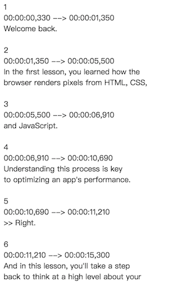
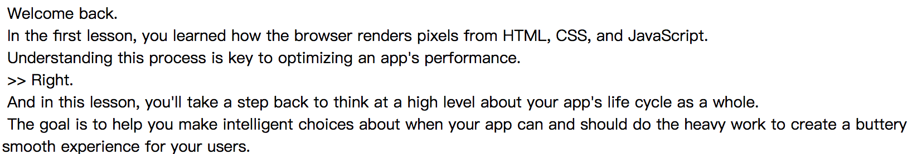

# 字幕格式化 Subtitle Format

## 这是什么 What is this

这是一个去除 **FileName.srt** 文件中的时间戳的英语字幕文件格式化工具。

This is a English subtitle formatting tool for removing time stamps inside the **FileName.srt** file.

之前 before:

之后 after：

## 怎么使用 How to use

点击此链接 Click this link: [https://mingkj.github.io/SubtitleFormat/](https://mingkj.github.io/SubtitleFormat/)

